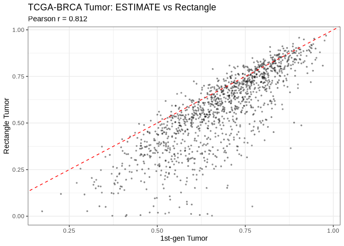
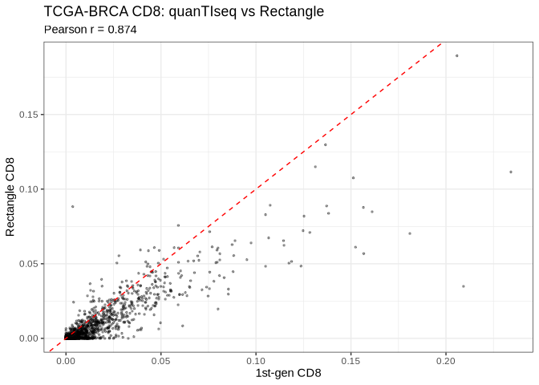
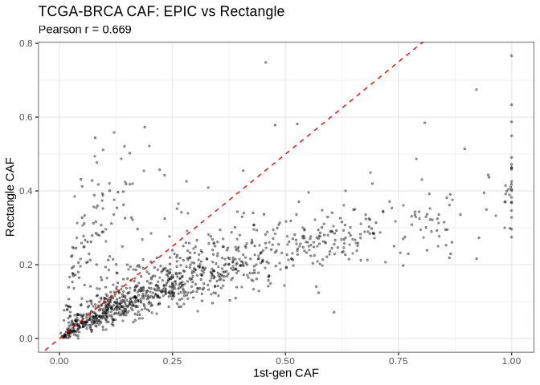
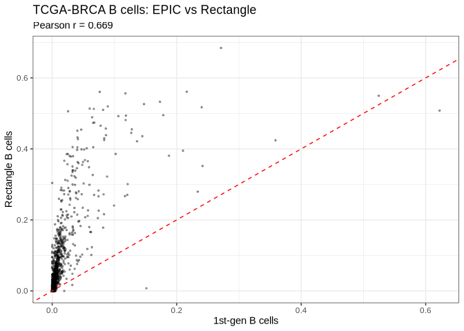

``` r
library(ggplot2)
library(knitr)

dir.create("../results/bulk_rnaseq/plots", recursive = TRUE, showWarnings = FALSE)
raw_tab <- read.csv("../results/bulk_rnaseq/tables/tcga_brca_all_methods_raw.csv", check.names = FALSE)
tab <- read.csv("../results/bulk_rnaseq/tables/tcga_brca_all_methods_aggregated.csv", check.names = FALSE)
```

## Methods

- Input dataset: `data/bulk_rnaseq/tcga_brca/brca_tpm_all_symbols.csv`
- Samples processed: all samples in the TPM matrix
- 1st gen methods were run through `immunedeconv`:
  - `estimate`
  - `quantiseq`
  - `epic`
- 2nd gen method:
  - `Rectangle`
- Rectangle used the existing Wu reference and current
  `config/rectangle.yaml`

## Dataset Summary

``` r
summary_df <- data.frame(
  metric = c("n samples", "n columns raw merged", "n columns aggregated"),
  value = c(nrow(tab), ncol(raw_tab), ncol(tab))
)
kable(summary_df)
```

| metric               | value |
|:---------------------|------:|
| n samples            |  1230 |
| n columns raw merged |    63 |
| n columns aggregated |    71 |

``` r
meta_cols <- intersect(c("sample_type", "PAM50"), colnames(tab))
if (length(meta_cols) == 0) {
  cat("No metadata columns available in aggregated table.")
} else {
  for (col in meta_cols) {
    cat("\n###", col, "\n\n")
    kable(head(sort(table(tab[[col]]), decreasing = TRUE), 20))
  }
}
```

    ## 
    ## ### sample_type 
    ## 
    ## 
    ## ### PAM50

## Raw Output Preview

``` r
kable(head(raw_tab, 10))
```

| sample_id | estimate_stroma.score | estimate_immune.score | estimate_estimate.score | estimate_tumor.purity | quantiseq_B.cell | quantiseq_Macrophage.M1 | quantiseq_Macrophage.M2 | quantiseq_Monocyte | quantiseq_Neutrophil | quantiseq_NK.cell | quantiseq_T.cell.CD4…non.regulatory. | quantiseq_T.cell.CD8. | quantiseq_T.cell.regulatory..Tregs. | quantiseq_Myeloid.dendritic.cell | quantiseq_uncharacterized.cell | epic_B.cell | epic_Cancer.associated.fibroblast | epic_T.cell.CD4. | epic_T.cell.CD8. | epic_Endothelial.cell | epic_Macrophage | epic_NK.cell | epic_uncharacterized.cell | rectangle_B.cells.Memory | rectangle_B.cells.Naive | rectangle_CAFs.MSC.iCAF.like | rectangle_CAFs.myCAF.like | rectangle_Cancer.Basal.SC | rectangle_Cancer.Her2.SC | rectangle_Cancer.LumA.SC | rectangle_Cancer.LumB.SC | rectangle_DCs | rectangle_Endothelial.ACKR1 | rectangle_Endothelial.CXCL12 | rectangle_Endothelial.Lymphatic.LYVE1 | rectangle_Endothelial.RGS5 | rectangle_Macrophage | rectangle_Monocyte | rectangle_NK.cells | rectangle_NKT.cells | rectangle_PVL.Differentiated | rectangle_PVL.Immature | rectangle_Plasmablasts | rectangle_T.cells.CD4. | rectangle_T.cells.CD8. | rectangle_Unknown | case_id | sample_type | project_id | patient_barcode | sample_type_code | origin | tissue | disease | dataset | sample_short | OS | OS_time | PAM50 | IntegrativeCluster | gender | age |
|:---|---:|---:|---:|---:|---:|---:|---:|---:|---:|---:|---:|---:|---:|---:|---:|---:|---:|---:|---:|---:|---:|---:|---:|---:|---:|---:|---:|---:|---:|---:|---:|---:|---:|---:|---:|---:|---:|---:|---:|---:|---:|---:|---:|---:|---:|---:|:---|:---|:---|:---|---:|:---|:---|:---|:---|:---|---:|---:|:---|:---|:---|---:|
| TCGA-AC-A2QI-01A-12R-A19W-07 | 1136.9253 | 1080.2603 | 2217.1856 | 0.5974777 | 0.0276283 | 0.0327281 | 0.1366240 | 0 | 0.0311895 | 0.0193788 | 0.0225955 | 0.0244427 | 0.0482969 | 0.0101463 | 0.6469697 | 0.0093514 | 0.5884225 | 0.0278834 | 0.0000095 | 0.0949833 | 0.0296663 | 0.0001628 | 0.2495208 | 0.0048779 | 0.0083717 | 0.0000000 | 0.2606123 | 0.0000000 | 0.0422816 | 0.3570441 | 0.1310590 | 0.0000000 | 0.0002360 | 0.0000000 | 0.0000842 | 0.0675115 | 0.0650269 | 0.0000000 | 0 | 0.0000000 | 0.0000000 | 0.0000000 | 0.0120772 | 0.0308828 | 0.0199348 | 0.0000000 | NA | Primary Tumor | TCGA-BRCA | TCGA-AC-A2QI | 1 | Primary | Breast | BRCA | TCGA | TCGA-AC-A2QI-01 | 0 | 588 | BRCA.LumA | NA | female | 76 |
| TCGA-A8-A06R-01A-11R-A00Z-07 | 1184.0434 | 1090.6373 | 2274.6807 | 0.5906889 | 0.0203209 | 0.0523747 | 0.0424690 | 0 | 0.0074663 | 0.0056010 | 0.0650850 | 0.0038635 | 0.0304410 | 0.0019793 | 0.7703993 | 0.0259367 | 0.3965033 | 0.0000030 | 0.0000001 | 0.0595552 | 0.0169700 | 0.0000740 | 0.5009577 | 0.0073683 | 0.0115944 | 0.0000000 | 0.2474492 | 0.0000000 | 0.1181012 | 0.0000000 | 0.2006981 | 0.0000000 | 0.0000000 | 0.0005891 | 0.0043820 | 0.0309417 | 0.0451669 | 0.0029761 | 0 | 0.0072110 | 0.0000000 | 0.0000000 | 0.2709374 | 0.0372665 | 0.0000538 | 0.0152643 | NA | Primary Tumor | TCGA-BRCA | TCGA-A8-A06R | 1 | Primary | Breast | BRCA | TCGA | TCGA-A8-A06R-01 | 0 | 547 | BRCA.LumB | NA | female | 69 |
| TCGA-EW-A1PD-01A-11R-A144-07 | 962.9701 | 138.2535 | 1101.2235 | 0.7202498 | 0.0221430 | 0.0394076 | 0.0721576 | 0 | 0.0180741 | 0.0223992 | 0.0000000 | 0.0000000 | 0.0264801 | 0.0144398 | 0.7848986 | 0.0002249 | 0.5467768 | 0.0000065 | 0.0003128 | 0.1314792 | 0.0135780 | 0.0000000 | 0.3076217 | 0.0000000 | 0.0000000 | 0.0000000 | 0.2329411 | 0.0037466 | 0.0634521 | 0.0000000 | 0.5119412 | 0.0000000 | 0.0054774 | 0.0119560 | 0.0064583 | 0.0994754 | 0.0452048 | 0.0000000 | 0 | 0.0014846 | 0.0042799 | 0.0079860 | 0.0000000 | 0.0055466 | 0.0000500 | 0.0000000 | NA | Primary Tumor | TCGA-BRCA | TCGA-EW-A1PD | 1 | Primary | Breast | BRCA | TCGA | TCGA-EW-A1PD-01 | 0 | 424 | BRCA.LumA | NA | male | 61 |
| TCGA-AO-A12D-01A-11R-A115-07 | 1271.9095 | 1721.5539 | 2993.4634 | 0.5024269 | 0.0141456 | 0.0424675 | 0.0742255 | 0 | 0.0079940 | 0.0053101 | 0.0000000 | 0.0215616 | 0.0814227 | 0.0141310 | 0.7387420 | 0.0162189 | 0.3440720 | 0.0442698 | 0.0000006 | 0.0394569 | 0.0225603 | 0.0002259 | 0.5331956 | 0.0044709 | 0.0043064 | 0.0059872 | 0.1362102 | 0.0043064 | 0.2702934 | 0.1616165 | 0.0000000 | 0.0037929 | 0.0006884 | 0.0006394 | 0.0016613 | 0.0256478 | 0.0509404 | 0.0024776 | 0 | 0.0048010 | 0.0000000 | 0.0000000 | 0.2469446 | 0.0596976 | 0.0155182 | 0.0000000 | NA | Primary Tumor | TCGA-BRCA | TCGA-AO-A12D | 1 | Primary | Breast | BRCA | TCGA | TCGA-AO-A12D-01 | 0 | 2515 | BRCA.Her2 | NA | female | 43 |
| TCGA-AR-A24N-01A-11R-A169-07 | 674.2924 | 225.1469 | 899.4393 | 0.7404784 | 0.0180020 | 0.0607672 | 0.0613528 | 0 | 0.0259823 | 0.0223047 | 0.0262278 | 0.0019357 | 0.0229873 | 0.0032044 | 0.7572362 | 0.0067185 | 0.3707163 | 0.0385541 | 0.0025366 | 0.0259934 | 0.0065438 | 0.0000001 | 0.5489372 | 0.0099516 | 0.0050785 | 0.0000000 | 0.2393959 | 0.0000000 | 0.0000000 | 0.2325079 | 0.3356035 | 0.0006815 | 0.0001181 | 0.0298782 | 0.0000000 | 0.0000000 | 0.0086939 | 0.0007363 | 0 | 0.0016160 | 0.0000000 | 0.0000000 | 0.1325432 | 0.0005573 | 0.0026383 | 0.0000000 | NA | Primary Tumor | TCGA-BRCA | TCGA-AR-A24N | 1 | Primary | Breast | BRCA | TCGA | TCGA-AR-A24N-01 | 0 | 3035 | BRCA.LumB | NA | female | 54 |
| TCGA-AR-A24U-01A-11R-A169-07 | 1391.2772 | 1922.5878 | 3313.8650 | 0.4612222 | 0.0270998 | 0.0612646 | 0.0902042 | 0 | 0.0341875 | 0.0078738 | 0.0906344 | 0.0208619 | 0.0613962 | 0.0083624 | 0.5981153 | 0.0401475 | 0.2491270 | 0.1167560 | 0.0000001 | 0.0580387 | 0.0275889 | 0.0000000 | 0.5083418 | 0.0276135 | 0.0075824 | 0.0000000 | 0.1077365 | 0.0249134 | 0.0638303 | 0.0000000 | 0.0326850 | 0.0032589 | 0.0250665 | 0.0251983 | 0.0000000 | 0.0000000 | 0.0701753 | 0.0088661 | 0 | 0.0098869 | 0.0000000 | 0.0000000 | 0.3619772 | 0.0545278 | 0.0045293 | 0.1721525 | NA | Primary Tumor | TCGA-BRCA | TCGA-AR-A24U | 1 | Primary | Breast | BRCA | TCGA | TCGA-AR-A24U-01 | 0 | 3128 | BRCA.Her2 | NA | female | 47 |
| TCGA-D8-A1JU-01A-11R-A13Q-07 | 1868.1052 | 1114.4196 | 2982.5249 | 0.5038146 | 0.0157386 | 0.0381940 | 0.1454913 | 0 | 0.0407233 | 0.0207239 | 0.0000000 | 0.0229137 | 0.0298957 | 0.0142818 | 0.6720379 | 0.0000002 | 0.9932427 | 0.0000000 | 0.0005035 | 0.0024610 | 0.0031816 | 0.0006104 | 0.0000006 | 0.0048877 | 0.0000000 | 0.0378381 | 0.3665342 | 0.0000000 | 0.0474460 | 0.1463710 | 0.1828949 | 0.0000000 | 0.0300626 | 0.0198263 | 0.0031785 | 0.0495313 | 0.0886580 | 0.0000000 | 0 | 0.0032063 | 0.0000000 | 0.0000213 | 0.0195438 | 0.0000000 | 0.0000000 | 0.0000000 | NA | Primary Tumor | TCGA-BRCA | TCGA-D8-A1JU | 1 | Primary | Breast | BRCA | TCGA | TCGA-D8-A1JU-01 | 0 | 447 | BRCA.LumA | NA | female | 51 |
| TCGA-A8-A0AD-01A-11R-A056-07 | 1094.2878 | 866.5058 | 1960.7935 | 0.6272268 | 0.0213159 | 0.0312102 | 0.2183849 | 0 | 0.0148324 | 0.0165811 | 0.0000000 | 0.0002906 | 0.0189480 | 0.0000000 | 0.6784370 | 0.0000026 | 0.6403038 | 0.0077622 | 0.0000001 | 0.0252813 | 0.0181691 | 0.0000677 | 0.3084132 | 0.0000000 | 0.0000000 | 0.0000000 | 0.2150300 | 0.0119560 | 0.0000000 | 0.5619041 | 0.1157820 | 0.0000000 | 0.0000000 | 0.0040323 | 0.0000000 | 0.0175011 | 0.0689322 | 0.0000000 | 0 | 0.0000000 | 0.0000000 | 0.0000000 | 0.0000000 | 0.0036605 | 0.0012020 | 0.0000000 | NA | Primary Tumor | TCGA-BRCA | TCGA-A8-A0AD | 1 | Primary | Breast | BRCA | TCGA | TCGA-A8-A0AD-01 | 0 | 1157 | BRCA.LumA | NA | female | 83 |
| TCGA-E2-A3DX-01A-21R-A213-07 | 1597.9510 | 1975.6018 | 3573.5528 | 0.4270728 | 0.0427680 | 0.0287226 | 0.1270752 | 0 | 0.0230001 | 0.0179009 | 0.0525058 | 0.0879370 | 0.0393669 | 0.0071586 | 0.5735649 | 0.0379178 | 0.8399268 | 0.0000116 | 0.0000000 | 0.0963070 | 0.0258327 | 0.0000033 | 0.0000008 | 0.0044836 | 0.0035432 | 0.0089694 | 0.2680847 | 0.0000000 | 0.0241857 | 0.0799165 | 0.0981623 | 0.0027784 | 0.0353730 | 0.0072132 | 0.0028985 | 0.0300090 | 0.0495998 | 0.0002565 | 0 | 0.0033414 | 0.0000000 | 0.0000000 | 0.2695449 | 0.0669426 | 0.0446974 | 0.0000000 | NA | Primary Tumor | TCGA-BRCA | TCGA-E2-A3DX | 1 | Primary | Breast | BRCA | TCGA | TCGA-E2-A3DX-01 | 0 | 1325 | BRCA.LumA | NA | female | 43 |
| TCGA-BH-A18J-11A-31R-A12D-07 | 828.2763 | 514.8697 | 1343.1460 | 0.6951660 | 0.0102785 | 0.0102057 | 0.0882738 | 0 | 0.1372932 | 0.0224026 | 0.0000000 | 0.0139248 | 0.0182163 | 0.0161252 | 0.6832799 | 0.0038553 | 0.0383119 | 0.0627445 | 0.0153191 | 0.1980168 | 0.0195168 | 0.0000000 | 0.6622356 | 0.0051265 | 0.0000000 | 0.2728963 | 0.0000000 | 0.0300857 | 0.0428613 | 0.2176259 | 0.0506981 | 0.0000000 | 0.0809887 | 0.0430496 | 0.0016481 | 0.0443469 | 0.0402689 | 0.0000000 | 0 | 0.0000000 | 0.1385399 | 0.0000000 | 0.0317642 | 0.0000999 | 0.0000000 | 0.0000000 | NA | Solid Tissue Normal | TCGA-BRCA | TCGA-BH-A18J | 11 | Normal | Breast | BRCA | TCGA | TCGA-BH-A18J-11 | 1 | 612 | BRCA.Normal | NA | female | 56 |

## Aggregated Comparison

``` r
mk_scatter <- function(df, x, y, title, xlab, ylab, out_png) {
  d <- data.frame(x = as.numeric(df[[x]]), y = as.numeric(df[[y]]))
  d <- d[complete.cases(d), , drop = FALSE]
  r <- if (nrow(d) > 1) cor(d$x, d$y, method = "pearson") else NA_real_
  p <- ggplot(d, aes(x = x, y = y)) +
    geom_point(size = 0.6, alpha = 0.35) +
    geom_abline(slope = 1, intercept = 0, linetype = "dashed", color = "red") +
    labs(
      title = title,
      subtitle = paste0("Pearson r = ", ifelse(is.na(r), "NA", sprintf("%.3f", r))),
      x = xlab,
      y = ylab
    ) +
    theme_bw(base_size = 11)
  ggsave(out_png, p, width = 6, height = 5, dpi = 300, bg = "white")
  print(p)
  invisible(r)
}

comparisons <- data.frame(
  metric = c("Tumor", "CD8", "CAF", "B cells"),
  method = c("ESTIMATE", "quanTIseq", "EPIC", "EPIC"),
  x = c("estimate_tumor", "quantiseq_cd8", "epic_caf", "epic_bcells"),
  y = c("rectangle_tumor", "rectangle_cd8", "rectangle_caf", "rectangle_bcells"),
  stringsAsFactors = FALSE
)

cors <- numeric(nrow(comparisons))
for (i in seq_len(nrow(comparisons))) {
  row <- comparisons[i, ]
  png_path <- file.path("../results/bulk_rnaseq/plots", paste0("tcga_brca_", make.names(row$metric), "_scatter.png"))
  cors[[i]] <- mk_scatter(
    tab, row$x, row$y,
    paste0("TCGA-BRCA ", row$metric, ": ", row$method, " vs Rectangle"),
    paste0("1st-gen ", row$metric),
    paste0("Rectangle ", row$metric),
    png_path
  )
}
```

<!-- --><!-- --><!-- --><!-- -->

``` r
comparisons$pearson_r <- cors
kable(comparisons[, c("metric", "method", "x", "y", "pearson_r")])
```

| metric  | method    | x              | y                | pearson_r |
|:--------|:----------|:---------------|:-----------------|----------:|
| Tumor   | ESTIMATE  | estimate_tumor | rectangle_tumor  | 0.8121907 |
| CD8     | quanTIseq | quantiseq_cd8  | rectangle_cd8    | 0.8738960 |
| CAF     | EPIC      | epic_caf       | rectangle_caf    | 0.6694251 |
| B cells | EPIC      | epic_bcells    | rectangle_bcells | 0.6693490 |

## Session Info

``` r
sessionInfo()
```

    ## R version 4.3.3 (2024-02-29)
    ## Platform: x86_64-conda-linux-gnu (64-bit)
    ## Running under: Rocky Linux 8.10 (Green Obsidian)
    ## 
    ## Matrix products: default
    ## BLAS/LAPACK: /gpfs/gpfs1/scratch/c9881013/.conda_envs/spacedeconv-env/lib/libmkl_rt.so;  LAPACK version 3.8.0
    ## 
    ## locale:
    ##  [1] LC_CTYPE=en_US.UTF-8       LC_NUMERIC=C              
    ##  [3] LC_TIME=en_US.UTF-8        LC_COLLATE=en_US.UTF-8    
    ##  [5] LC_MONETARY=en_US.UTF-8    LC_MESSAGES=en_US.UTF-8   
    ##  [7] LC_PAPER=en_US.UTF-8       LC_NAME=C                 
    ##  [9] LC_ADDRESS=C               LC_TELEPHONE=C            
    ## [11] LC_MEASUREMENT=en_US.UTF-8 LC_IDENTIFICATION=C       
    ## 
    ## time zone: Europe/Vienna
    ## tzcode source: system (glibc)
    ## 
    ## attached base packages:
    ## [1] stats     graphics  grDevices utils     datasets  methods   base     
    ## 
    ## other attached packages:
    ## [1] knitr_1.50     ggplot2_3.5.2  rmarkdown_2.29
    ## 
    ## loaded via a namespace (and not attached):
    ##  [1] vctrs_0.6.5        cli_3.6.5          rlang_1.1.6        xfun_0.53         
    ##  [5] generics_0.1.4     textshaping_1.0.1  labeling_0.4.3     glue_1.8.0        
    ##  [9] htmltools_0.5.8.1  ragg_1.5.0         scales_1.4.0       grid_4.3.3        
    ## [13] evaluate_1.0.5     tibble_3.3.0       fastmap_1.2.0      yaml_2.3.10       
    ## [17] lifecycle_1.0.4    compiler_4.3.3     dplyr_1.1.4        RColorBrewer_1.1-3
    ## [21] pkgconfig_2.0.3    systemfonts_1.2.3  farver_2.1.2       digest_0.6.37     
    ## [25] R6_2.6.1           tidyselect_1.2.1   dichromat_2.0-0.1  pillar_1.11.0     
    ## [29] magrittr_2.0.3     withr_3.0.2        tools_4.3.3        gtable_0.3.6
